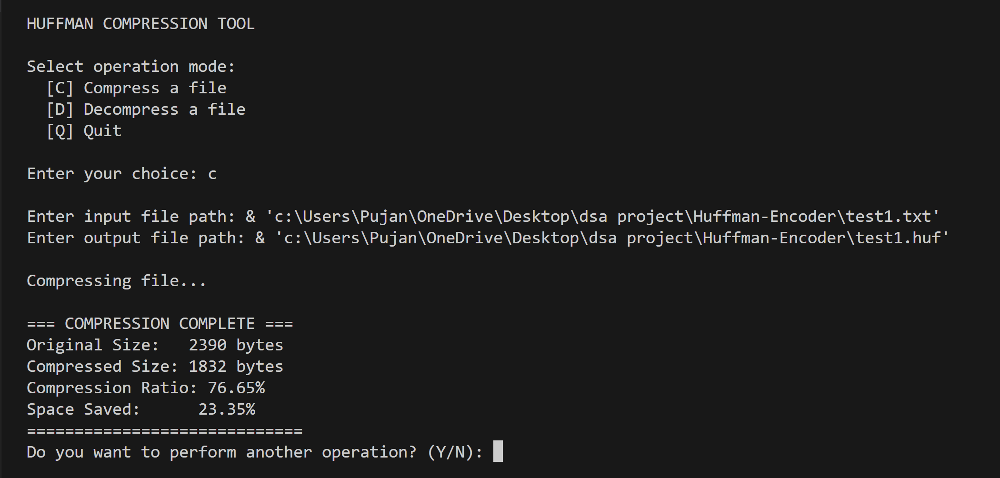
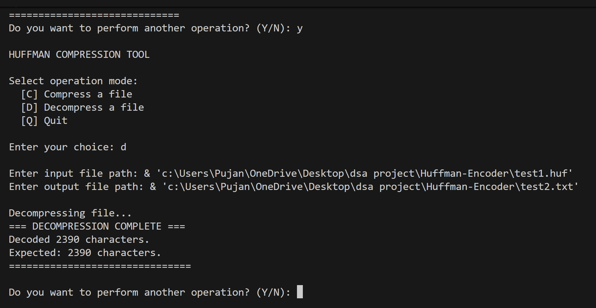

# Huffman Encoder

A command-line Huffman coding utility written in C that compresses and decompresses files using frequency-based prefix codes.

It supports:
- **Compression** of any binary/text file into a custom `.huf` format
- **Decompression** back to original bytes
- **Interactive mode** (menu-driven)
- **Direct CLI mode** (pass a file path argument)

## Table of Contents
- [Overview](#overview)
- [Features](#features)
- [How It Works](#how-it-works)
- [Project Structure](#project-structure)
- [Build](#build)
- [Usage](#usage)
  - [Direct CLI mode](#direct-cli-mode)
  - [Interactive mode](#interactive-mode)
- [Compressed File Format](#compressed-file-format)
- [Screenshots](#screenshots)
- [Limitations and Notes](#limitations-and-notes)
- [Troubleshooting](#troubleshooting)
- [License](#license)

## Overview
This project implements the full Huffman pipeline:
1. Count input byte frequencies
2. Build a Huffman tree with a min-heap
3. Generate variable-length binary codes
4. Write a compact bitstream with a header required for reconstruction
5. Rebuild the tree during decompression and decode bits back to the original file

## Features
- Byte-level frequency analysis (`0-255`)
- Huffman tree construction via custom min-heap
- Bit-packed writer/reader for compressed payload
- Header-based decompression (stores enough metadata to rebuild the tree)
- Compression statistics printed after encode (sizes, ratio, saved space)
- Safety prompt when compressed output is larger than original
- Input path sanitization helpers (trims whitespace, quotes, and optional leading `&`)

## How It Works
### Compression
- Reads the input in binary mode
- Computes frequency table (`uint32_t freq[256]`)
- Builds a Huffman tree from non-zero frequencies
- Generates Huffman codes for each used byte
- Writes output header:
  - total character count (`uint32_t`)
  - unique character count (`uint16_t`)
  - each symbol + frequency pair (`1 + 4` bytes)
- Encodes file contents as Huffman bits and flushes remaining partial byte

### Decompression
- Reads header values
- Reconstructs the same Huffman tree from symbol-frequency pairs
- Reads compressed payload bit-by-bit
- Traverses tree until leaf nodes are reached and writes original bytes
- Stops after decoding the expected number of characters

## Project Structure
```text
Huffman-Encoder/
├── latest.c                 # Main implementation (compression + decompression)
├── output/
│   ├── Compress.png         # Compression flow/image asset
│   └── Decompress.png       # Decompression flow/image asset
└── .gitignore
```

## Build
From the repository root:

```bash
gcc -Wall -Wextra -pedantic latest.c -o huffman
```

If you prefer a minimal build:

```bash
gcc latest.c -o huffman
```

## Usage
### Direct CLI mode
Pass one file path argument:

```bash
./huffman <path>
```

Behavior:
- If `<path>` ends in `.huf` (case-insensitive), the tool **decompresses** to:
  - `<path>_restored`
- Otherwise, the tool **compresses** to:
  - `<path>.huf`

Examples:

```bash
./huffman notes.txt          # creates notes.txt.huf
./huffman notes.txt.huf      # creates notes.txt.huf_restored
```

### Interactive mode
Run without arguments:

```bash
./huffman
```

Menu options:
- `C` Compress
- `D` Decompress
- `Q` Quit

In this mode, you manually provide both input and output file paths.

## Compressed File Format
The `.huf` file contains:

1. **Total characters** (`uint32_t`)
2. **Unique symbol count** (`uint16_t`)
3. Repeated `unique_count` times:
   - symbol byte (`unsigned char`)
   - symbol frequency (`uint32_t`)
4. Bit-packed Huffman payload

This format is specific to this implementation and is effectively **platform-dependent** because raw integers are written/read directly via `fwrite`/`fread`. That means byte order follows the host platform's native endianness (not a fixed on-disk endianness), so cross-platform interchange is safest only between systems with matching endianness and compatible integer representation.

## Screenshots
Compression:



Decompression:



## Limitations and Notes
- Output can be larger than input for small/high-entropy files (header overhead). The tool warns and lets you delete or keep the compressed file.
- Internal path buffers are fixed at 512 bytes (`char inputPath[512]`, `char outputPath[512]`), and generated names are built with `sprintf`; if paths are too long, this risks undefined behavior from buffer overflow. As a practical guideline, keep input paths comfortably below 500 characters to leave room for suffixes like `.huf` and `_restored`.
- The project is currently a single-file C implementation (`latest.c`) with no Makefile/CMake script.
- No automated test suite is included in the repository.

## Troubleshooting
- **"Error opening input file"**: verify file exists and path is correct.
- **"Error reading header" during decompression**: input may not be a valid `.huf` created by this tool.
- **Decoded count mismatch warning**: file may be corrupted or incomplete.

## License
No license file is currently included in this repository.
Without an explicit license, the project is effectively **all rights reserved** by default, so reuse, modification, and redistribution are not automatically permitted.
If you plan to allow reuse, add a `LICENSE` file with your intended terms.
